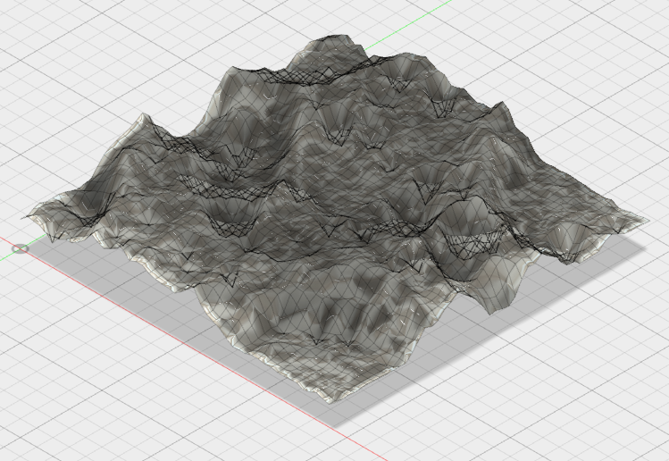
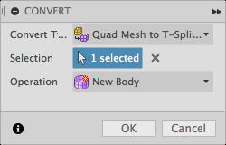

#  Fusion360Image2Surface

This is an [Autodesk Fusion 360](http://fusion360.autodesk.com/) script that's used for generating surfaces from images.

NOTE NOTE NOTE: There's an issue with this running on Windows.  Mac currently works.  Fix in progress.

 

## Installation

Copy the "Fusion360Image2Surface" folder into your Fusion 360 "My Scripts" folder. You may find this folder using the following steps:

1. Start Fusion 360 and then select the File -> Scripts... menu item
2. The Scripts Manager dialog will appear and display the "My Scripts" folder and "Sample Scripts" folders
3. Select one of the "My Scripts" files and then click on the "+" Details icon near the bottom of the dialog.
  - If there are no files in the "My Scripts" folder then create a default one.
  - Click the Create button, select JavaScript, and then OK.
4. With the user script selected, click the Full Path "..." button to display a file explorer window that will display the "My Scripts" folder
5. Copy this scripts folder into this location

For example, on my Mac the folder is located in:

/Users/USERNAME/Library/Application Support/Autodesk/Autodesk Fusion 360/API/Scripts

## Usage

1. Enter the Model environment
2. If not in direct modeling mode, create a Base Feature that will hold the surface mesh
  - Select Create->Create Base Feature

    

3. Run the "Image2Surface" script from the Script Manager

  

4. A file dialog will be displayed.
  - Select an image file to convert to a surface and click OK.
  - Note, because of limitations in Fusion on the size of meshes, I highly recommend using only very small images. For example, the moon image used to generate the above surface is only 50x50 pixels. If you have an image that's large then create a smaller version of it then import that.

5. The settings dialog will be shown.  Adjust your preferences:

  

  - Style : Select one of the following styles to generate
    - "Mesh Body" : mesh that can be converted to a T-Spline
    - "Sketch Points" : sketch containing points for each pixel
    - "Sketch Lines" : sketch containing lines simulating a mesh (warning SLOW)
  - Length per pixel : The distance between vertices, one vertex per pixel
  - Max surface height : The maximum height the normalized image values are mapped to.
  - Export format : Select one of the following
    - "OBJ" : a Wavefront OBJ file containing the mesh (quad faces)
    - "STL" : a STereoLithography file containing the mesh (triangle faces only)
6. Click OK to generate the surface
  - Note, if an OBJ or STL file with the same name as the image file already exists you will be prompted to overwrite it.

Once the mesh or sketch is created it will be added to the drawing. You might have to "fit" the view to see it.

If you have created a mesh then it's useful to convert it to a T-Spline or BRep for further modification.

- Mesh to T-Spline

  1. Enter the Sculpt environment
  2. Select the Modify->Convert toolbar item
  3. Follow the steps in the dialog to convert the mesh to a T-Spline

    

- Mesh to BRep

  1. Enter the Model or Patch environment
  2. Select the mesh
  3. Select the Modify->Mesh->Mesh to BRep toolbar item

Note that the default settings "Mesh Body" style and "OBJ" export format are required for a usable mesh to be used in Fusion 360.  The other two styles are good for experimenting but don't create a mesh.  And the STL format only supports triangular faces, which can be used to create a mesh in Fusion, but the mesh can't be converted to a T-Spline. Note, you can use the OBJ or STL file generated in another application such as [Autodesk Meshmixer](http://www.meshmixer.com/). For example, to decimate the mesh (simplify) and then load that into Fusion 360.

Here's the heightmap image of the moon's surface that was used to generate the mesh and t-spline shown at the top of the page.

And here's the t-spline in the CAM environment being used to create toolpaths for milling:

More examples posted on my [Fusion 360 project gallery](https://fusion360.autodesk.com/users/hans-kellner).

## Issues

- none
